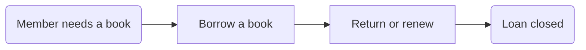

# 🗺️ Flowcharts

## Overview: click a box to open its flowchart

```mermaid
flowchart LR
    s("Member needs a book")
    b["Borrow a book"]
    r["Return or renew"]
    e("Loan closed")
    s --> b --> r --> e
    click b "/wiki-pages-demo/flowcharts/borrow-a-book/" "Open the Borrow a book flowchart"
    click r "/wiki-pages-demo/flowcharts/return-a-book/" "Open the Return a book flowchart"
```
