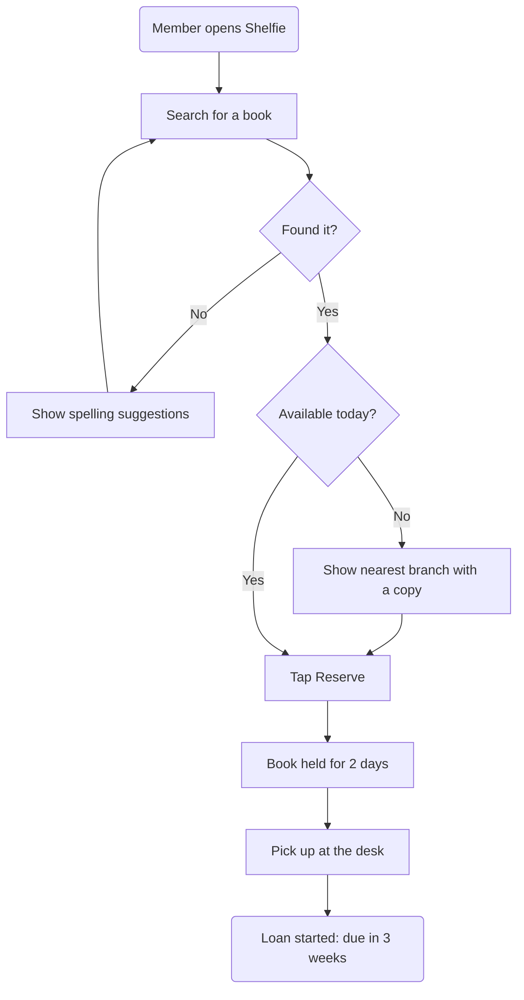

# Flowchart – Borrow a book

*Made-up content for the Shelfie demo.* Based on use case 2 and issues #1, #2.

```mermaid
flowchart TD
    a("Member opens Shelfie")
    b["Search for a book"]
    c{"Found it?"}
    d["Show spelling suggestions"]
    e{"Available today?"}
    f["Show nearest branch with a copy"]
    g["Tap Reserve"]
    h["Book held for 2 days"]
    i["Pick up at the desk"]
    j("Loan started: due in 3 weeks")

    a --> b --> c
    c -->|No| d --> b
    c -->|Yes| e
    e -->|No| f --> g
    e -->|Yes| g
    g --> h --> i --> j
```
